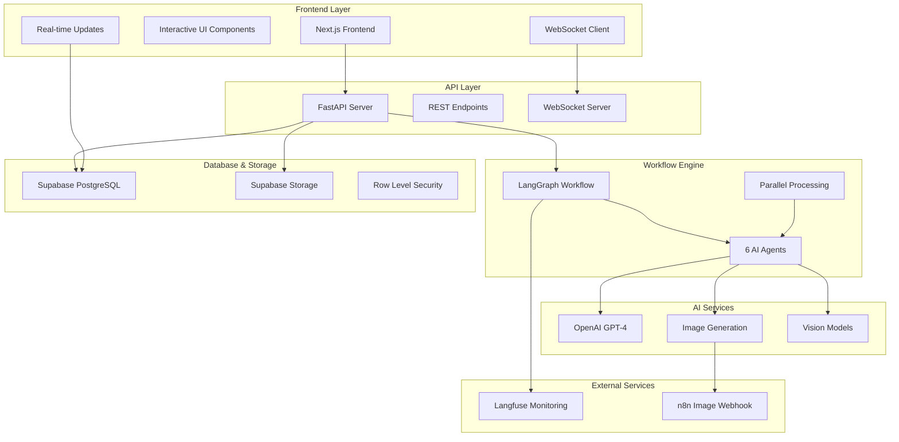
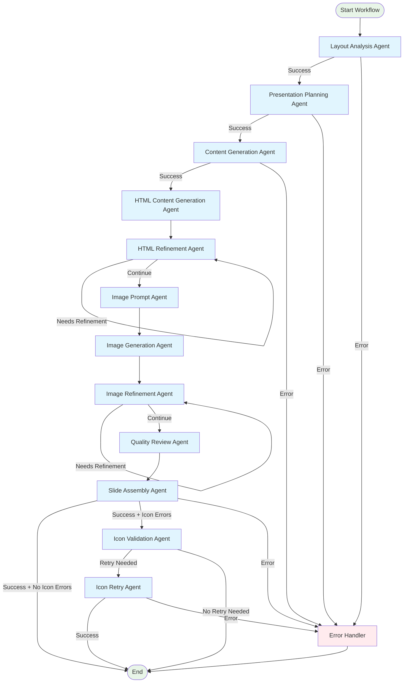
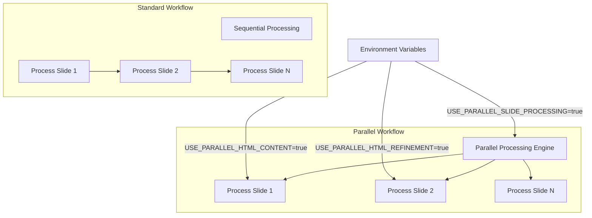
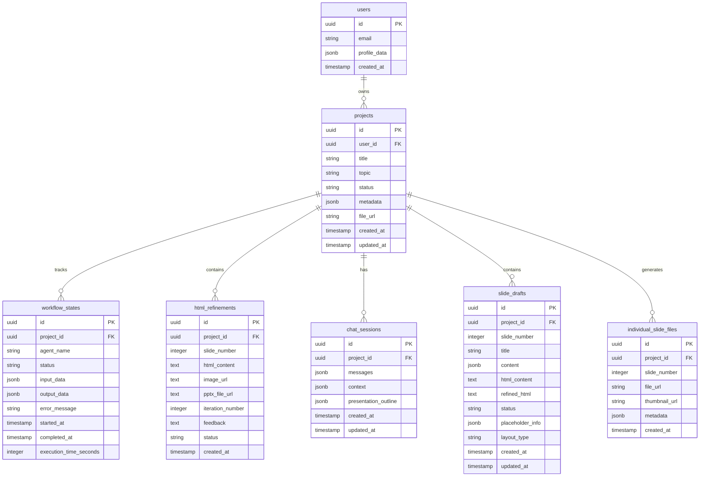
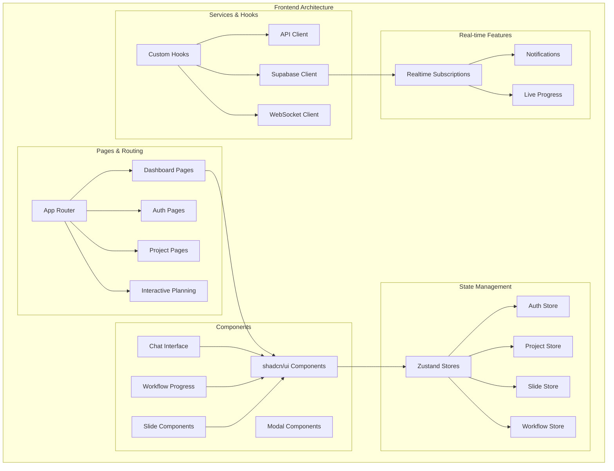
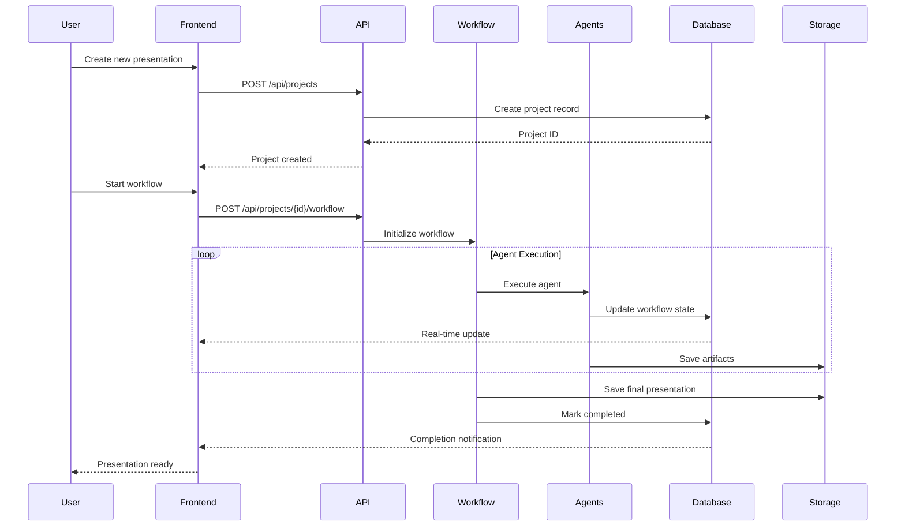
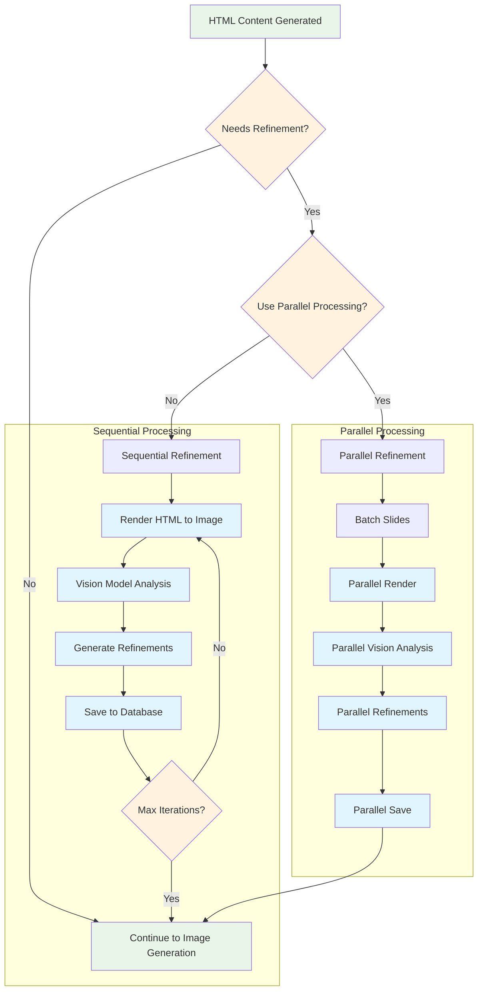

# PowerPoint Slide Creator - Complete Repository Overview

## Table of Contents
1. [System Architecture Overview](#system-architecture-overview)
2. [Agent-Based Workflow System](#agent-based-workflow-system)
3. [Database Architecture](#database-architecture)
4. [Frontend Architecture](#frontend-architecture)
5. [Key Classes and Components](#key-classes-and-components)
6. [Data Flow Diagrams](#data-flow-diagrams)
7. [File Structure](#file-structure)

## System Architecture Overview

This is an AI-powered PowerPoint slide generation system built with a **6-agent LangGraph workflow**, Next.js frontend, Python FastAPI backend, and Supabase database. The system creates presentations through intelligent content generation, HTML visualizations, image generation, and automated slide assembly.



## Agent-Based Workflow System

The core of the system is a **6-agent LangGraph workflow** that processes presentations through specialized AI agents:



### Agent Details

1. **Layout Analysis Agent** (`src/agents.py:92`) - Analyzes PowerPoint templates and creates dynamic Pydantic models
2. **Presentation Planning Agent** - Creates intelligent slide structure with detailed specifications  
3. **Content Generation Agent** - Generates contextual content with full presentation awareness
4. **HTML Content Generation Agent** (`src/html_content_agent.py`) - Creates HTML visualizations for complex content
5. **HTML Refinement Agent** - Uses visual feedback to iteratively improve HTML content
6. **Slide Assembly Agent** - Creates final PowerPoint presentation with all content and formatting

### Parallel Processing Support

The system supports parallel slide processing for improved performance:



## Database Architecture

The system uses **Supabase PostgreSQL** with a comprehensive schema supporting real-time updates, user management, and workflow tracking:



### Key Database Features

- **Row Level Security (RLS)** - User data isolation
- **Real-time Subscriptions** - Live workflow updates
- **JSONB Storage** - Flexible structured data
- **UUID Primary Keys** - Globally unique identifiers
- **Automated Triggers** - `updated_at` timestamp management

### Database Operations

The `src/database.py` module provides a centralized client with comprehensive error handling:

```python
# Key database classes
class SupabaseClient:
    def create_project(...)
    def update_project_status(...)
    def get_project_workflow_states(...)
    def create_workflow_state(...)
    def create_html_refinement(...)

# Error handling hierarchy
DatabaseError
├── DatabaseConnectionError
├── DatabaseValidationError  
└── DatabasePermissionError
```

## Frontend Architecture

The **Next.js 15** frontend provides a modern, interactive interface with real-time updates:



### Frontend Key Features

- **Interactive Planning** - Chat-based presentation planning
- **Real-time Updates** - Live workflow progress tracking
- **Slide Management** - Individual slide editing and preview
- **Responsive Design** - Mobile-first Tailwind CSS
- **State Persistence** - Zustand with localStorage
- **Type Safety** - Full TypeScript coverage

### Key Frontend Components

```typescript
// State management
interface ProjectStore {
  projects: Project[]
  currentProject: Project | null
  setProjects: (projects: Project[]) => void
  updateProject: (id: string, updates: Partial<Project>) => void
}

// Real-time hooks
const useWorkflowManagement = (projectId: string) => {
  // WebSocket connection for live updates
  // Workflow state management
  // Progress tracking
}

const useWorkflowNotifications = () => {
  // Toast notifications
  // Status updates
  // Error handling
}
```

## Key Classes and Components

### Backend Core Classes

#### 1. SlideGenerationWorkflow (`src/workflow.py:35`)
```python
class SlideGenerationWorkflow:
    def __init__(self, use_parallel_html_refinement: bool = True)
    def run(self, topic: str, template_path: str, output_path: str, ...) -> Dict[str, Any]
    def run_streamlined_for_approved_outline(self, ...) -> Dict[str, Any]
    def run_parallel_for_approved_outline(self, ...) -> Dict[str, Any]
    
    # Agent instances
    layout_agent: LayoutAnalysisAgent
    planning_agent: PresentationPlanningAgent
    content_agent: ContentGenerationAgent
    html_content_agent: HTMLContentGenerationAgent
    refinement_agent: HTMLRefinementAgent
    assembly_agent: SlideAssemblyAgent
```

#### 2. SupabaseClient (`src/database.py`)
```python
class SupabaseClient:
    def create_project(self, user_id: str, title: str, topic: str) -> str
    def update_project_status(self, project_id: str, status: str, file_url: str = None) -> bool
    def create_workflow_state(self, project_id: str, agent_name: str, status: str, ...) -> str
    def get_project_workflow_states(self, project_id: str) -> List[Dict[str, Any]]
    def create_html_refinement(self, project_id: str, slide_number: int, ...) -> str
```

#### 3. Agent Base Classes
```python
class SlideGenerationState(TypedDict):
    # Input parameters
    topic: str
    template_path: str
    output_path: str
    
    # Workflow state
    current_step: str
    error_message: Optional[str]
    retry_count: int
    
    # Agent results
    layouts_info: Optional[Dict]
    presentation_plan: Optional[List[SlideSpec]]
    slide_contents: Optional[List[SlideContent]]
```

### Frontend Core Components

#### 1. Zustand Stores
```typescript
// Project Store
interface ProjectStore {
  projects: Project[]
  currentProject: Project | null
  filters: ProjectFilters
  pagination: PaginationState
  isLoading: boolean
  error: string | null
  selectedProjects: string[]
}

// Workflow Store  
interface WorkflowStore {
  workflowStates: WorkflowState[]
  isConnected: boolean
  connectionError: string | null
  lastUpdate: Date | null
}
```

#### 2. React Hooks
```typescript
// Workflow Management Hook
const useWorkflowManagement = (projectId: string) => {
  return {
    workflowStates: WorkflowState[],
    isConnected: boolean,
    connectionError: string | null,
    startWorkflow: () => Promise<void>,
    pauseWorkflow: () => Promise<void>,
    resumeWorkflow: () => Promise<void>
  }
}

// Supabase Auth Hook
const useSupabaseAuth = () => {
  return {
    user: User | null,
    session: Session | null,
    loading: boolean,
    signIn: (email: string, password: string) => Promise<void>,
    signOut: () => Promise<void>
  }
}
```

## Data Flow Diagrams

### 1. Presentation Creation Flow



### 2. Real-time Updates Flow

```mermaid
graph LR
    subgraph "Backend Updates"
        WF[Workflow Agent] --> DB[(Database)]
        API[API Server] --> DB
        WS[WebSocket Server] --> DB
    end
    
    subgraph "Real-time Sync"
        DB --> RT[Supabase Realtime]
        RT --> SUB[Subscriptions]
    end
    
    subgraph "Frontend Updates"
        SUB --> HOOK[useWorkflowManagement]
        HOOK --> STORE[Zustand Store] 
        STORE --> UI[React Components]
        UI --> NOTIF[Toast Notifications]
    end
    
    classDef backend fill:#e3f2fd
    classDef realtime fill:#f3e5f5
    classDef frontend fill:#e8f5e8
    
    class WF,API,WS backend
    class DB,RT,SUB realtime  
    class HOOK,STORE,UI,NOTIF frontend
```

### 3. HTML Refinement Process



## File Structure

```
PowerPoint Slide Creator/
├── README.md
├── CLAUDE.md                          # Development guidelines
├── requirements.txt                   # Python dependencies
├── pyproject.toml                     # Python project config
├── ekona_slides_template_new.pptx    # PowerPoint template
├── layouts_export.json              # Template analysis cache
│
├── src/                              # Backend Python application
│   ├── workflow.py                   # Main LangGraph workflow orchestration
│   ├── agents.py                     # AI agent implementations
│   ├── database.py                   # Centralized Supabase client
│   ├── api_server.py                 # FastAPI REST server
│   ├── html_content_agent.py         # HTML visualization generation
│   ├── html_renderer.py              # Multi-engine HTML rendering
│   ├── layout_analyzer.py            # PowerPoint template analysis
│   ├── llm_client.py                # OpenAI client wrapper
│   ├── monitoring.py                # Langfuse monitoring integration
│   ├── parallel_workflow.py         # Parallel processing engine
│   ├── individual_slide_generator.py # Individual slide processing
│   ├── thumbnail_generator.py        # Slide thumbnail generation
│   └── ...                          # Additional utilities
│
├── frontend/                         # Next.js 15 application
│   ├── src/
│   │   ├── app/                      # App Router pages
│   │   │   ├── (auth)/              # Authentication pages
│   │   │   ├── (dashboard)/         # Dashboard pages
│   │   │   └── api/                 # API routes
│   │   ├── components/               # React components
│   │   │   ├── auth/                # Authentication components
│   │   │   ├── chat/                # Interactive planning
│   │   │   ├── workflow/            # Workflow progress tracking
│   │   │   ├── slides/              # Slide management
│   │   │   └── ui/                  # shadcn/ui components
│   │   ├── stores/                  # Zustand state management
│   │   │   ├── authStore.ts
│   │   │   ├── projectStore.ts
│   │   │   ├── slideStore.ts
│   │   │   └── workflowStore.ts
│   │   ├── hooks/                   # Custom React hooks
│   │   │   ├── useSupabaseAuth.ts
│   │   │   ├── useWorkflowManagement.ts
│   │   │   └── useWorkflowNotifications.ts
│   │   └── lib/                     # Utility libraries
│   │       ├── supabase/            # Supabase client configuration
│   │       └── api.ts               # API client
│   ├── package.json
│   ├── next.config.ts
│   └── tsconfig.json
│
├── database/                         # Database migrations
│   └── migrations/
│       ├── 001_add_interactive_tables.sql
│       ├── 002_add_rls_policies.sql
│       ├── 003_add_slide_status_tracking.sql
│       └── 004_add_individual_slide_files.sql
│
├── generated_presentations/          # Output PowerPoint files (git-ignored)
├── html_debug/                       # HTML refinement debug files (git-ignored)
└── icon_cache/                       # Lucide icon assets for slides
```

### Key Configuration Files

- **Environment Variables** - OpenAI, Supabase, Langfuse, Azure Storage
- **Parallel Processing** - `USE_PARALLEL_SLIDE_PROCESSING`, `USE_PARALLEL_HTML_CONTENT`, `USE_PARALLEL_HTML_REFINEMENT`
- **Template Analysis** - `layouts_export.json` caches PowerPoint template structure
- **Icon Management** - `src/lucide-sprite.svg` provides icon definitions for HTML rendering

## Summary

This PowerPoint Slide Creator is a sophisticated AI-powered system that combines:

- **Advanced AI Workflow** - 6-agent LangGraph system with specialized responsibilities
- **Real-time Frontend** - Modern Next.js interface with live progress tracking
- **Scalable Database** - Supabase with comprehensive schema and RLS
- **Parallel Processing** - Configurable concurrent slide generation
- **Visual Intelligence** - HTML rendering and vision model refinement
- **Comprehensive Monitoring** - Langfuse integration for workflow observability

The system demonstrates modern full-stack architecture with emphasis on AI workflow orchestration, real-time user experience, and scalable data management.