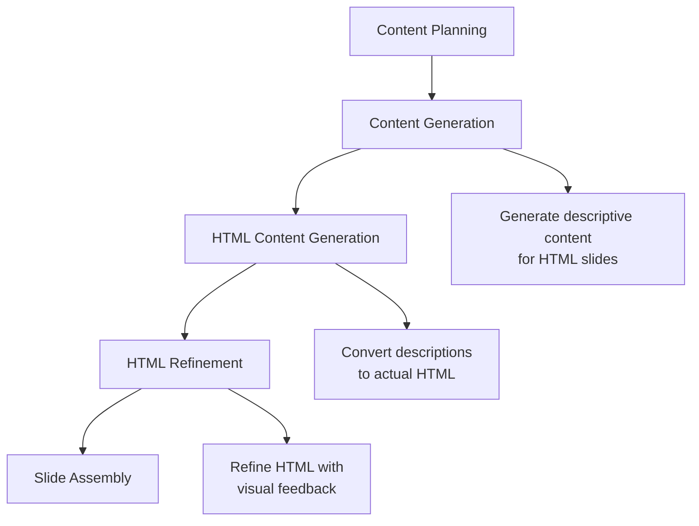

# HTML Generation Workflow Separation - Fix Summary

## Problem Identified
The workflow was unnecessarily duplicating HTML generation in two phases:

1. **Content Generation Phase**: Generated actual HTML code for slides marked with `is_html: true`
2. **HTML Content Generation Phase**: Generated HTML code again from the same content

This caused:
- ❌ Wasted LLM calls
- ❌ Confusion about responsibilities
- ❌ Potential inconsistencies
- ❌ Longer processing time

## Solution Implemented

### 🔧 Phase 1: Content Generation (Modified)
**Role**: Generate **descriptive content** for HTML slides
- ✅ Describes what should be visualized (timeline, process, comparison)
- ✅ Provides structured data and information
- ✅ Includes specific data points, steps, sequences
- ✅ Focuses on INFORMATION to be visualized
- ❌ **NO LONGER generates HTML code**

**Example Output for HTML Slide**:
```
Timeline showing 4 key phases: 
Phase 1 (Jan 2024): Discovery and planning with stakeholder interviews and requirements gathering
Phase 2 (Feb-Mar 2024): Development of core features including user authentication and data models
Phase 3 (Apr 2024): Testing and quality assurance with automated testing and user acceptance
Phase 4 (May 2024): Launch and deployment with monitoring and support infrastructure
```

### 🎨 Phase 2: HTML Content Generation (Clarified Role)
**Role**: Convert descriptive content into actual HTML visualizations
- ✅ Takes descriptive content from Phase 1
- ✅ Converts descriptions into functional HTML code
- ✅ Creates actual visualizations using Mermaid.js, DaisyUI, Flowbite
- ✅ Optimizes for 1577x603px PowerPoint containers

**Example HTML Output**:
```html
<!DOCTYPE html>
<html>
<head>
    <script src="https://cdn.jsdelivr.net/npm/mermaid/dist/mermaid.min.js"></script>
    <style>/* Tailwind + Brand colors */</style>
</head>
<body class="w-[1577px] h-[603px] flex flex-col p-8">
    <h1 class="text-3xl font-bold mb-4">Project Timeline</h1>
    <div class="mermaid flex-grow">
        timeline
            title Project Timeline
            2024-01 : Discovery : Requirements : Stakeholder Interviews
            2024-02 : Development : Core Features : Authentication
            2024-04 : Testing : QA Process : User Acceptance
            2024-05 : Launch : Deployment : Support
    </div>
</body>
</html>
```

## Files Modified

### ✅ `src/llm_client.py`
- **Line 328-350**: Updated content generation guidance for HTML slides
- **Line 655-685**: Added HTML guidance to unified generation system prompt
- **Key Change**: Emphasizes generating descriptions, not HTML code

### ✅ `src/html_content_agent.py`
- **Line 51-85**: Updated execute method documentation and messaging
- **Line 218-270**: Updated _process_planned_html_slides method
- **Line 835-870**: Updated HTML generation prompts and system prompts
- **Key Change**: Clarified role as "content converter" not "content generator"

## Benefits Achieved

### 🚀 Performance Benefits
- ⚡ **Faster Processing**: Eliminates duplicate HTML generation
- 💰 **Cost Reduction**: Fewer LLM API calls
- 🔄 **Better Parallelization**: HTML refinement can focus on actual HTML

### 🎯 Quality Benefits  
- 📋 **Clear Separation**: Each phase has a distinct, well-defined role
- 🔧 **Better Debugging**: Easier to identify where issues occur
- 📈 **Improved Consistency**: Structured handoff between phases

### 🛠️ Development Benefits
- 🧩 **Modular Design**: Clean separation of concerns
- 🔍 **Easier Testing**: Each phase can be tested independently
- 📝 **Better Logging**: Clear phase-specific progress messages

## Workflow Overview



## Testing Recommendation

Run a presentation generation with HTML slides and observe:
1. ✅ Content generation logs show "descriptive content"
2. ✅ HTML generation logs show "converting descriptions"
3. ✅ No duplicate HTML generation
4. ✅ Final HTML is properly formatted and functional

## Conclusion

This fix eliminates the unnecessary duplication while maintaining the powerful two-phase approach:
- **Phase 1**: Smart content planning with rich descriptions
- **Phase 2**: Expert HTML conversion with visual optimization

The workflow is now more efficient, clearer, and easier to maintain. 